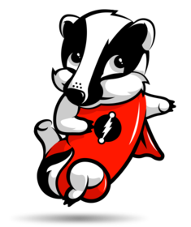

# BadgerDB [](https://pkg.go.dev/github.com/dgraph-io/badger/v3) [](https://goreportcard.com/report/github.com/dgraph-io/badger) [](https://sourcegraph.com/github.com/dgraph-io/badger?badge) [/statusIcon.svg)](https://teamcity.dgraph.io/viewLog.html?buildTypeId=Badger_UnitTests&buildId=lastFinished&guest=1)  [](https://coveralls.io/github/dgraph-io/badger?branch=master)



BadgerDB is an embeddable, persistent and fast key-value (KV) database written
in pure Go. It is the underlying database for [Dgraph](https://dgraph.io), a
fast, distributed graph database. It's meant to be a performant alternative to
non-Go-based key-value stores like RocksDB.

**Use [Discuss Issues](https://discuss.dgraph.io/c/issues/badger/37) for reporting issues about this repository.**

## Project Status [March 24, 2020]

Badger is stable and is being used to serve data sets worth hundreds of
terabytes. Badger supports concurrent ACID transactions with serializable
snapshot isolation (SSI) guarantees. A Jepsen-style bank test runs nightly for
8h, with `--race` flag and ensures the maintenance of transactional guarantees.
Badger has also been tested to work with filesystem level anomalies, to ensure
persistence and consistency. Badger is being used by a number of projects which
includes Dgraph, Jaeger Tracing, UsenetExpress, and many more.

The list of projects using Badger can be found [here](#projects-using-badger).

Badger v1.0 was released in Nov 2017, and the latest version that is data-compatible
with v1.0 is v1.6.0.

Badger v2.0 was released in Nov 2019 with a new storage format which won't
be compatible with all of the v1.x. Badger v2.0 supports compression, encryption and uses a cache to speed up lookup.

The [Changelog] is kept fairly up-to-date.

For more details on our version naming schema please read [Choosing a version](#choosing-a-version).

[Changelog]:https://github.com/dgraph-io/badger/blob/master/CHANGELOG.md

## Table of Contents
 * [Getting Started](#getting-started)
    + [Installing](#installing)
      - [Installing Badger Command Line Tool](#installing-badger-command-line-tool)
      - [Choosing a version](#choosing-a-version)
  * [Badger Documentation](#badger-documentation)
  * [Resources](#resources)
    + [Blog Posts](#blog-posts)
  * [Design](#design)
    + [Comparisons](#comparisons)
    + [Benchmarks](#benchmarks)
  * [Projects Using Badger](#projects-using-badger)
  * [Contributing](#contributing)
  * [Contact](#contact)

## Getting Started

### Installing
To start using Badger, install Go 1.12 or above. Badger v2 needs go modules. Run the following command to retrieve the library.

```sh
$ go get github.com/dgraph-io/badger/v3
```
This will retrieve the library.

#### Installing Badger Command Line Tool

Download and extract the latest Badger DB release from https://github.com/dgraph-io/badger/releases and then run the following commands.

```sh
$ cd badger-<version>/badger
$ go install
```
This will install the badger command line utility into your $GOBIN path.

#### Choosing a version

BadgerDB is a pretty special package from the point of view that the most important change we can
make to it is not on its API but rather on how data is stored on disk.

This is why we follow a version naming schema that differs from Semantic Versioning.

- New major versions are released when the data format on disk changes in an incompatible way.
- New minor versions are released whenever the API changes but data compatibility is maintained.
 Note that the changes on the API could be backward-incompatible - unlike Semantic Versioning.
- New patch versions are released when there's no changes to the data format nor the API.

Following these rules:

- v1.5.0 and v1.6.0 can be used on top of the same files without any concerns, as their major
 version is the same, therefore the data format on disk is compatible.
- v1.6.0 and v2.0.0 are data incompatible as their major version implies, so files created with
 v1.6.0 will need to be converted into the new format before they can be used by v2.0.0.

For a longer explanation on the reasons behind using a new versioning naming schema, you can read
[VERSIONING.md](VERSIONING.md).

## Badger Documentation

Badger Documentation is available at https://dgraph.io/docs/badger

## Resources

### Blog Posts
1. [Introducing Badger: A fast key-value store written natively in
Go](https://open.dgraph.io/post/badger/)
2. [Make Badger crash resilient with ALICE](https://blog.dgraph.io/post/alice/)
3. [Badger vs LMDB vs BoltDB: Benchmarking key-value databases in Go](https://blog.dgraph.io/post/badger-lmdb-boltdb/)
4. [Concurrent ACID Transactions in Badger](https://blog.dgraph.io/post/badger-txn/)

## Design
Badger was written with these design goals in mind:

- Write a key-value database in pure Go.
- Use latest research to build the fastest KV database for data sets spanning terabytes.
- Optimize for SSDs.

Badger’s design is based on a paper titled _[WiscKey: Separating Keys from
Values in SSD-conscious Storage][wisckey]_.

[wisckey]: https://www.usenix.org/system/files/conference/fast16/fast16-papers-lu.pdf

### Comparisons
| Feature                        | Badger                                     | RocksDB                       | BoltDB    |
| -------                        | ------                                     | -------                       | ------    |
| Design                         | LSM tree with value log                    | LSM tree only                 | B+ tree   |
| High Read throughput           | Yes                                        | No                            | Yes       |
| High Write throughput          | Yes                                        | Yes                           | No        |
| Designed for SSDs              | Yes (with latest research <sup>1</sup>)    | Not specifically <sup>2</sup> | No        |
| Embeddable                     | Yes                                        | Yes                           | Yes       |
| Sorted KV access               | Yes                                        | Yes                           | Yes       |
| Pure Go (no Cgo)               | Yes                                        | No                            | Yes       |
| Transactions                   | Yes, ACID, concurrent with SSI<sup>3</sup> | Yes (but non-ACID)            | Yes, ACID |
| Snapshots                      | Yes                                        | Yes                           | Yes       |
| TTL support                    | Yes                                        | Yes                           | No        |
| 3D access (key-value-version)  | Yes<sup>4</sup>                            | No                            | No        |

<sup>1</sup> The [WISCKEY paper][wisckey] (on which Badger is based) saw big
wins with separating values from keys, significantly reducing the write
amplification compared to a typical LSM tree.

<sup>2</sup> RocksDB is an SSD optimized version of LevelDB, which was designed specifically for rotating disks.
As such RocksDB's design isn't aimed at SSDs.

<sup>3</sup> SSI: Serializable Snapshot Isolation. For more details, see the blog post [Concurrent ACID Transactions in Badger](https://blog.dgraph.io/post/badger-txn/)

<sup>4</sup> Badger provides direct access to value versions via its Iterator API.
Users can also specify how many versions to keep per key via Options.

### Benchmarks
We have run comprehensive benchmarks against RocksDB, Bolt and LMDB. The
benchmarking code, and the detailed logs for the benchmarks can be found in the
[badger-bench] repo. More explanation, including graphs can be found the blog posts (linked
above).

[badger-bench]: https://github.com/dgraph-io/badger-bench

## Projects Using Badger
Below is a list of known projects that use Badger:

* [Dgraph](https://github.com/dgraph-io/dgraph) - Distributed graph database.
* [Jaeger](https://github.com/jaegertracing/jaeger) - Distributed tracing platform.
* [go-ipfs](https://github.com/ipfs/go-ipfs) - Go client for the InterPlanetary File System (IPFS), a new hypermedia distribution protocol.
* [Riot](https://github.com/go-ego/riot) - An open-source, distributed search engine.
* [emitter](https://github.com/emitter-io/emitter) - Scalable, low latency, distributed pub/sub broker with message storage, uses MQTT, gossip and badger.
* [OctoSQL](https://github.com/cube2222/octosql) - Query tool that allows you to join, analyse and transform data from multiple databases using SQL.
* [Dkron](https://dkron.io/) - Distributed, fault tolerant job scheduling system.
* [smallstep/certificates](https://github.com/smallstep/certificates) - Step-ca is an online certificate authority for secure, automated certificate management.
* [Sandglass](https://github.com/celrenheit/sandglass) - distributed, horizontally scalable, persistent, time sorted message queue.
* [TalariaDB](https://github.com/grab/talaria) - Grab's Distributed, low latency time-series database.
* [Sloop](https://github.com/salesforce/sloop) - Salesforce's Kubernetes History Visualization Project.
* [Immudb](https://github.com/codenotary/immudb) - Lightweight, high-speed immutable database for systems and applications.
* [Usenet Express](https://usenetexpress.com/) - Serving over 300TB of data with Badger.
* [gorush](https://github.com/appleboy/gorush) - A push notification server written in Go.
* [Dispatch Protocol](https://github.com/dispatchlabs/disgo) - Blockchain protocol for distributed application data analytics.
* [GarageMQ](https://github.com/valinurovam/garagemq) - AMQP server written in Go.
* [RedixDB](https://alash3al.github.io/redix/) - A real-time persistent key-value store with the same redis protocol.
* [BBVA](https://github.com/BBVA/raft-badger) - Raft backend implementation using BadgerDB for Hashicorp raft.
* [Fantom](https://github.com/Fantom-foundation/go-lachesis) - aBFT Consensus platform for distributed applications.
* [decred](https://github.com/decred/dcrdata) - An open, progressive, and self-funding cryptocurrency with a system of community-based governance integrated into its blockchain.
* [OpenNetSys](https://github.com/opennetsys/c3-go) - Create useful dApps in any software language.
* [HoneyTrap](https://github.com/honeytrap/honeytrap) - An extensible and opensource system for running, monitoring and managing honeypots.
* [Insolar](https://github.com/insolar/insolar) - Enterprise-ready blockchain platform.
* [IoTeX](https://github.com/iotexproject/iotex-core) - The next generation of the decentralized network for IoT powered by scalability- and privacy-centric blockchains.
* [go-sessions](https://github.com/kataras/go-sessions) - The sessions manager for Go net/http and fasthttp.
* [Babble](https://github.com/mosaicnetworks/babble) - BFT Consensus platform for distributed applications.
* [Tormenta](https://github.com/jpincas/tormenta) - Embedded object-persistence layer / simple JSON database for Go projects.
* [BadgerHold](https://github.com/timshannon/badgerhold) - An embeddable NoSQL store for querying Go types built on Badger
* [Goblero](https://github.com/didil/goblero) - Pure Go embedded persistent job queue backed by BadgerDB
* [Surfline](https://www.surfline.com) - Serving global wave and weather forecast data with Badger.
* [Cete](https://github.com/mosuka/cete) - Simple and highly available distributed key-value store built on Badger. Makes it easy bringing up a cluster of Badger with Raft consensus algorithm by hashicorp/raft. 
* [Volument](https://volument.com/) - A new take on website analytics backed by Badger.
* [KVdb](https://kvdb.io/) - Hosted key-value store and serverless platform built on top of Badger.
* [Terminotes](https://gitlab.com/asad-awadia/terminotes) - Self hosted notes storage and search server - storage powered by BadgerDB
* [Pyroscope](https://github.com/pyroscope-io/pyroscope) - Open source confinuous profiling platform built with BadgerDB
* [Veri](https://github.com/bgokden/veri) - A distributed feature store optimized for Search and Recommendation tasks.

If you are using Badger in a project please send a pull request to add it to the list.

## Contributing

If you're interested in contributing to Badger see [CONTRIBUTING.md](./CONTRIBUTING.md).

## Contact
- Please use [discuss.dgraph.io](https://discuss.dgraph.io) for questions, feature requests and discussions.
- Please use [Github issue tracker](https://github.com/dgraph-io/badger/issues) for filing bugs or feature requests.
- Follow us on Twitter [@dgraphlabs](https://twitter.com/dgraphlabs).

